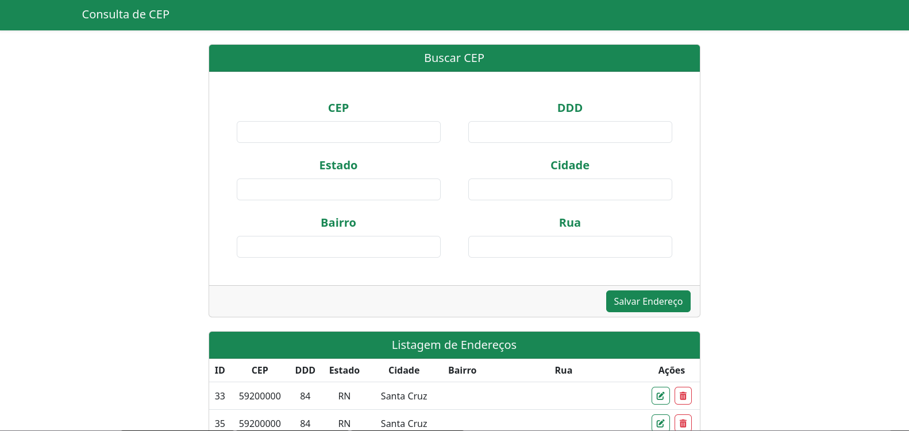
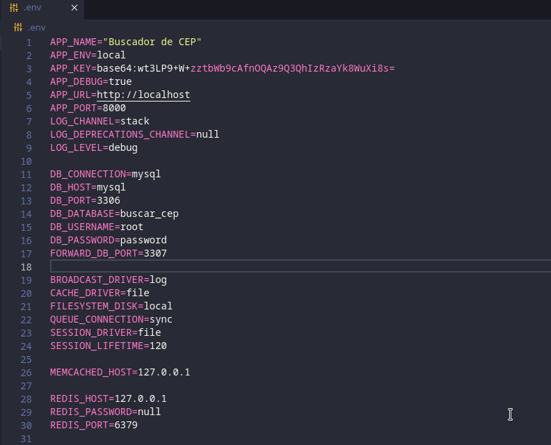

<h1><a href="https://github.com/vitorcosta42/app_locadora_carros/tree/master">Consulta de CEP - Vitor Costa </a></h1>

   
   
    
    
    
    

<h2>Descrição</h2>

  Projeto Full-Stack utilizando Vue.js e Bootstrap para o Front-end, e PHP, Laravel e MySQL para o back-end. Temos autenticação, validação, criação, edição, listagem e remoção de carros, locações, clientes, modelos e marcas de carros! Um projeto muito completo e com várias features que mostram um pouco do meu lado full-stack, espero que gostem.

<h2>Como utilizar</h2>

<h3>1. Clone o repositório:</h3>
<pre>
  <code>
    git clone https://github.com/vitorcosta42/buscar-cep.git
  </code>
</pre>

<h3>2. Entre no repositório clonado e instale as dependências:</h3>
<pre>
  <code>
    npm install
  </code>
</pre>
<pre>
  <code>
    composer install
  </code>
</pre>

<h3>3. Configure seu arquivo .env usando o .env.example como base. Exemplo: </h3>
<pre>
     
</pre>

<h3>3. Inicie os containers Docker usando Laravel Sail</h3>
<pre>
  <code>
    ./vendor/bin/sail up 
  </code>
</pre>
<h3>4. Faça as migrações</h3>
<pre>
  <code>
    ./vendor/bin/sail artisan migrate    
  </code>
</pre>
<h3>5. Inicie sua aplicação</h3>
<pre>
  <code>
    npm run dev   
  </code>
</pre>
<h6>Após realizar esta sequência de passos a aplicação já estará pronta para ser utilizada, se seguiu o .env de exemplo à risca, ela poderá ser acessada em <a href="http://localhost:8000/" target="_blank" >http://localhost:8000/</a> </h6>

<h2>Créditos</h2>
<table>
  <tr>
    <td align="center">
      <a href="https://github.com/vitorcosta42">
         
        
          <b>Vitor Costa</b>
        
      </a>
    </td>
  </tr>
</table>

<h2>Licença</h2>
<b>All Rights Reserved</b>
